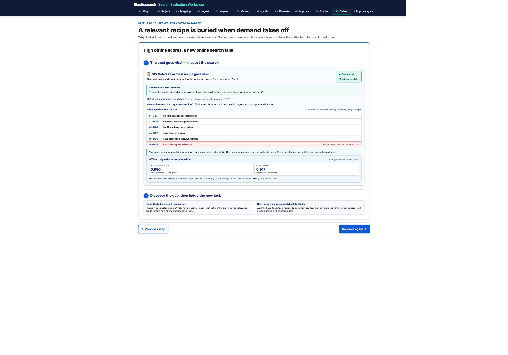
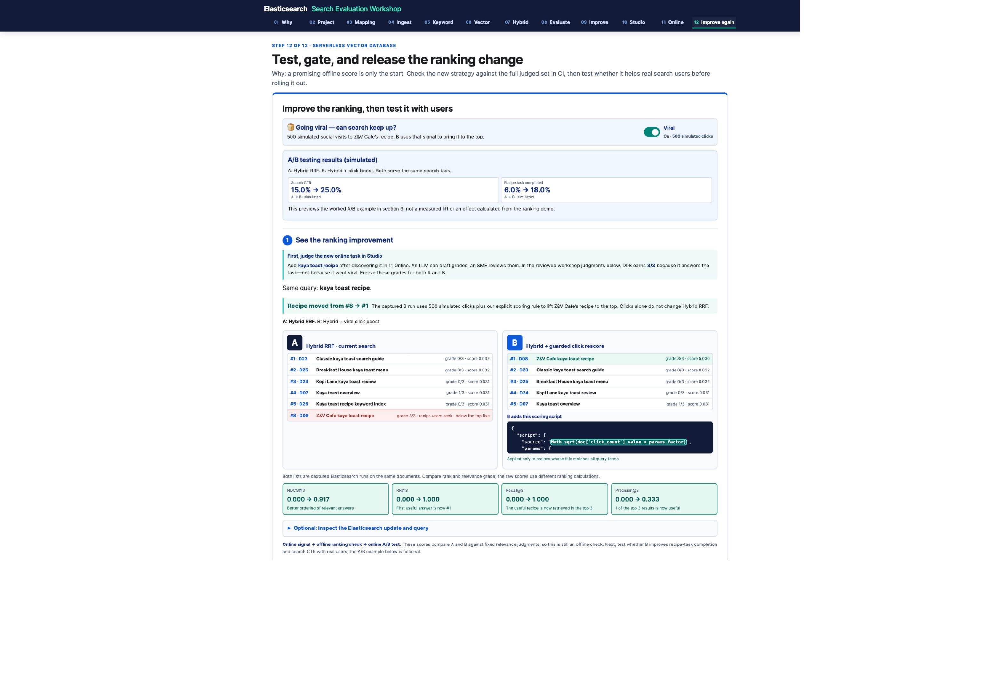

# Elasticsearch Search Evaluation Workshop

[Open the workshop](https://2gavy.github.io/evals/)

A self-contained, Singapore food-themed workshop on keyword, vector, and hybrid search evaluation. The website uses cached Elasticsearch results and needs no API key or local server.

## Workshop preview

Start with six judged queries in Relevance Studio and compare keyword, vector and Hybrid RRF. Hybrid and Semantic tie for the highest NDCG in the captured six-query benchmark.

### Discover a new online search

Users search for kaya toast after a fictional post goes viral. The recipe is buried at #8, and this task was not in the initial six-query benchmark.

### Judge, improve, and compare

Add the new task in Studio and review its grades. The captured click-rescored candidate moves the recipe from #8 to #1. Re-benchmark all seven queries before an online A/B test. The CTR and task-completion figures shown here are simulated, not measured user improvements.

